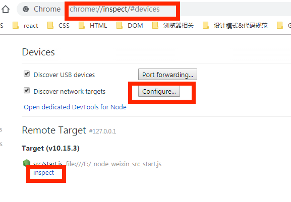
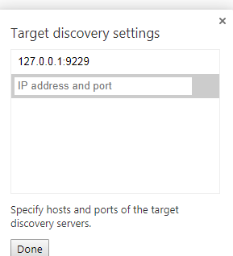
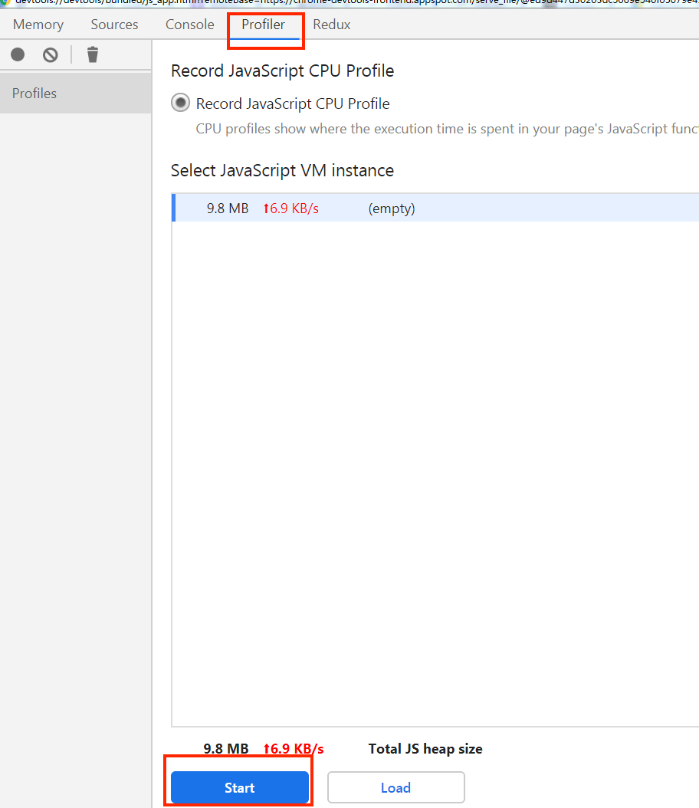

1. chrome 输入`chrome://inspect`，configure 添加`ip:port`，ip 和 port 参考第二步 cmd 的输出。然后点击`inspect`

2. `npm run analyze`启动

如下图：

如下图：

3. 进行压力测试

使用 apache bench
Post： ab -c 20 -n 250 -p post.txt -T text/plain "http://localhost/post/xx"

get: ab -c 20 -n 250 "http://localhost/post/get"

4. 收集并分析数据

   1. cpu
      点击 profile 进行 cpu 性能分析。
      
      分为 chart（图表），Heavy（调用栈从底层到顶层显示），Tree（调用栈从上往下显示）三种。
      ctrl+f 可以搜索，建议直接搜索 src/找出高耗时文件。

   2. 内存
      方法 1：
      记录开始时间点堆内存
      操作后，回收垃圾，记录堆内存
      选中第二次内存快照，选择第二项比较，查看右边图表的 size delta 也就是大小增量。
      一般如果增量第一位比第二位多一位或几位，就是有问题的，需要深入看，负责没问题。
      方法 2：
      还是如上记录两个快照，然后分别看两个快照的饼图，看百分比是不是基本一致，如果有一个明显占比多了，需要深入看。
      方法 3：
      有一个实时记录内存的选项，实时看下内存分配情况，是不是有暴涨的。
